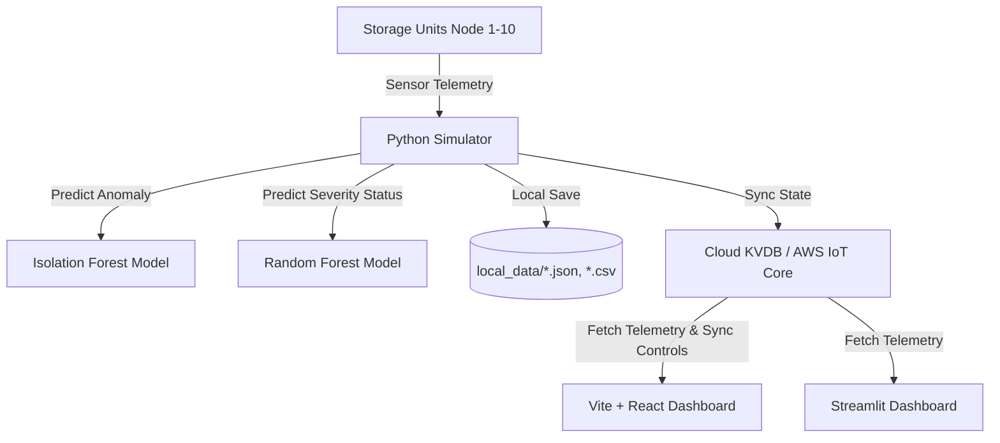

# R.E.M.A.C. (Remote Environmental Monitoring and Control System)

R.E.M.A.C. is an end-to-end framework designed for real-time telemetry monitoring, environmental control, and anomaly detection of physical storage units. The system tracks key telemetry metrics (Temperature, Humidity, Material Level, and Distance) for 10 individual units storing different polymer materials. It leverages machine learning models for predictive risk assessment and features dual dashboards (a Python Streamlit application and a React + Vite web dashboard).

---

## 🏗️ System Architecture



---

## 📂 Repository Layout

*   📁 **[dashboard/](file:///home/ubuntu/REMAC/dashboard)**: Contains the Streamlit-based interactive monitoring dashboard ([dashboard.py](file:///home/ubuntu/REMAC/dashboard/dashboard.py)).
*   📁 **[simulator/](file:///home/ubuntu/REMAC/simulator)**: Holds telemetry simulator scripts (e.g., [run_simulation.py](file:///home/ubuntu/REMAC/simulator/run_simulation.py)) simulating sensor outputs, and components for synchronizing with cloud providers.
*   📁 **[frontend/](file:///home/ubuntu/REMAC/frontend)**: A React-based Web Single Page Application (SPA) powered by Vite. Includes design systems ([index.css](file:///home/ubuntu/REMAC/frontend/src/index.css)) and real-time dashboard layouts ([App.jsx](file:///home/ubuntu/REMAC/frontend/src/App.jsx)).
*   📁 **[ml_models/](file:///home/ubuntu/REMAC/ml_models)**: Houses ML training scripts and the generated serialized models (e.g. `isolation_forest_model.pkl`, `random_forest_model.pkl`, `status_encoder.pkl`).
*   📁 **[datasets/](file:///home/ubuntu/REMAC/datasets)**: Source telemetry training logs per node.
*   📁 **[live_data/](file:///home/ubuntu/REMAC/live_data)**: Outputs of active telemetry logging (e.g. `latest_*.json`, `history_*.csv`).
*   📁 **[CERTIFICATES/](file:///home/ubuntu/REMAC/CERTIFICATES)**: Secure keys/certificates for authenticating with AWS IoT.

---

## 🤖 Machine Learning Pipeline

1.  **Anomaly Detection (Unsupervised):** An **Isolation Forest** model flags abnormal telemetry spikes or drift (`NORMAL` vs `ANOMALY`).
2.  **State Classification (Supervised):** A **Random Forest Classifier** maps environmental features to status flags (`SAFE`, `WARNING`, `DANGER`) tailored to material-specific safety baselines.

---

## 🚀 Quick Start Guide

### Prerequisites
*   Python 3.8+
*   Node.js 18+

### 1. Python Dashboard & Simulator Setup
Install Python packages:
```bash
pip install -r requirements.txt
```

Launch the Streamlit monitoring dashboard:
```bash
streamlit run dashboard/dashboard.py
```

Or run the simulator standalone in headless mode:
```bash
python simulator/run_simulation.py
```

### 2. React + Vite Frontend Setup
Navigate to the frontend directory, install npm dependencies, and start the local development server:
```bash
cd frontend
npm install
npm run dev
```

---

## ☁️ Cloud & IoT Integrations

*   **AWS IoT Core:** Node 1 can publish live MQTT payloads to the AWS IoT Core endpoint (`a1kneu9xpfe402-ats.iot.eu-north-1.amazonaws.com`) using certificates stored in the `CERTIFICATES/` directory.
*   **KVDB.io Cloud Sync:** Telemetry endpoints and simulation commands sync with a KVDB database bucket (`GXrQha8LsrxhmL2EL7TNGC`) for seamless command propagation between the dashboards and the backend simulation.
